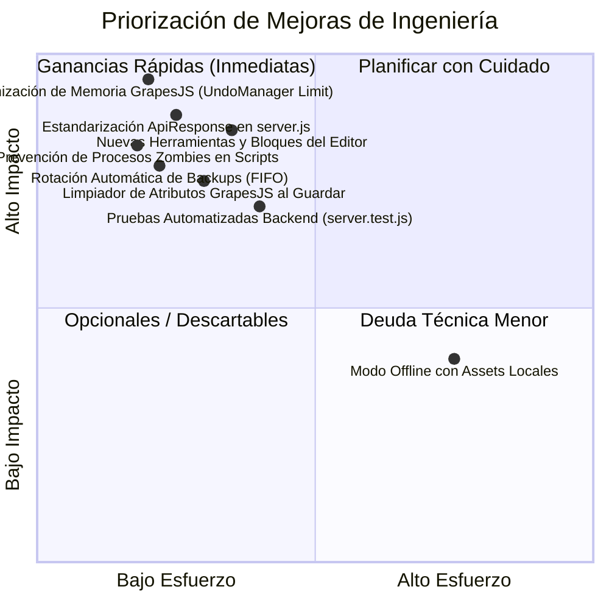

# AUDIT REPORT — Memexicanisimos Platform & Visual Studio (v3.1)
**Proyecto:** Memexicanisimos Web Platform & Open Source Visual Studio (`memexicanisimos.com`)  
**Fecha de Auditoría:** Septiembre 2026  
**Auditor:** Motor Autónomo de Auditoría y Evolución de Software Existente (Estándar de 5 Vectores)  
**Alcance:** Plataforma Web (`index.html`, `style.css`, `app.js`, `contracts/`, `tests/`) y Subsistema de Edición (`herramientas_editor/`, `server.js`, scripts de control).

---

## 1. Resumen Ejecutivo y Evaluación de Salud

| Vector | Salud (0-100) | Criticidad Dominante | Estado Diagnóstico |
| :--- | :---: | :---: | :--- |
| **V1: Dominio, Invariantes & Marco Legal** | 72% | Mayor | Aviso de privacidad LFPDPPP y deslindes presentes; falta política de retención y rotación de backups del editor. |
| **V2: Contratos de Datos, Esquema & Errores** | 48% | Crítico | El frontend web implementó `contracts/errors.js` y `ApiResponse<T>`, pero `server.js` del editor viola la Ley Global 5 al usar payloads informales. |
| **V3: Lógica, Concurrencia, Rendimiento & Hardening** | 42% | Crítico | **Causa raíz de cuelgues:** `UndoManager` sin tope de memoria clonando 366 KB de DOM por acción; Express con payload de 50MB sin compresión; falta de rotación de backups. |
| **V4: Superficie de Interfaz & Ergonomía** | 65% | Mayor | Interfaz patria consolidada; en el editor visual se requieren herramientas adicionales (bloques del ecosistema, editor de código limpio, selector de clases CSS y FSM en guardado). |
| **V5: Infraestructura, Resiliencia & Pruebas** | 50% | Mayor | Pruebas de contratos cliente aprobadas (100%); faltan pruebas de endpoints de `server.js`, validador de integridad de backups y detección de procesos zombies en scripts. |

---

## 2. Matriz Detallada de Hallazgos por Vector

### Vector 1: Dominio, Invariantes & Marco Legal
| Vector | Hallazgo | Criticidad | Evidencia | Acción Sugerida |
| :--- | :--- | :---: | :--- | :--- |
| **V1.1** | Invariante de almacenamiento de respaldos sin límite de retención | **Mayor** | `herramientas_editor/editor/server.js` (líneas 75-85): Cada guardado crea un archivo `index_backup_*.html` de ~370 KB de forma indefinida en `herramientas_editor/backups/`. | Implementar política FIFO de retención máxima (ej. últimos 15 respaldos) y compresión automática para evitar saturación de disco. |
| **V1.2** | Deslinde de responsabilidad técnica en editor local | **Menor** | No se advierte explícitamente en la UI del editor que la acción de guardado sobrescribe directamente el archivo fuente en producción local. | Añadir modal de confirmación con detalle del respaldo generado antes de escribir en `index.html`. |
| **V1.3** | Invariantes de los Tres Pilares (Humor, Apps Libres, Comunidad) | **Menor** | `DOMAIN_INVARIANTS.md` no se encuentra formalizado en la raíz del repositorio. | Formalizar documento que describa las reglas de negocio de la marca y la suite de software libre. |

---

### Vector 2: Contratos de Datos, Esquema & Catálogo de Fallos
| Vector | Hallazgo | Criticidad | Evidencia | Acción Sugerida |
| :--- | :--- | :---: | :--- | :--- |
| **V2.1** | Incumplimiento de la Ley Global 5 en la API del servidor local | **Crítico** | `server.js` (líneas 43-51, 54-87): Los endpoints `GET /api/page`, `POST /api/save` y `GET /api/assets` devuelven `{ success, html, css }` o `{ success, error }`, omitiendo la firma canónica `ApiResponse<T>`. | Refactorizar todas las respuestas del backend a la firma canónica: `{ success: boolean, data: T \| null, error_code: string \| null, message: string }`. |
| **V2.2** | Catálogo de errores desconectado entre backend y frontend | **Mayor** | `server.js` envía cadenas de texto arbitrarias en `error.message` en lugar de usar los identificadores de `contracts/errors.js`. | Exportar e importar `ErrorCode` en `server.js` (`BACKUP_CREATION_FAILED`, `FILE_WRITE_FAILED`, `PAYLOAD_INVALID`, `PORT_IN_USE`). |
| **V2.3** | Esquema de validación ausente en `POST /api/save` | **Mayor** | `server.js` (línea 57): Solo verifica `if (!html)`. No valida integridad mínima del DOCTYPE, ni etiquetas de cierre esenciales (`</html>`), permitiendo guardar archivos truncados. | Incorporar validador sintáctico estricto antes de escribir en disco. |

---

### Vector 3: Lógica de Dominio, Concurrencia, Rendimiento & Hardening
| Vector | Hallazgo | Criticidad | Evidencia | Acción Sugerida |
| :--- | :--- | :---: | :--- | :--- |
| **V3.1** | **Fuga de memoria y colapso por clonación masiva de DOM (`UndoManager`)** | **Crítico** | En `herramientas_editor/editor/public/index.html`: GrapesJS inicializa sobre un archivo de 366 KB con miles de nodos. El historial `UndoManager` por defecto guarda snapshots completos del DOM en cada micro-evento sin límite de pasos, consumiendo gigabytes de RAM hasta colgar la pestaña. | Configurar `undoManager: { trackSelection: false, maxSteps: 15 }` y optimizar la carga del lienzo para evitar desbordamiento de memoria heap. |
| **V3.2** | Límite de payload desproporcionado sin compresión | **Mayor** | `server.js` (línea 30): `app.use(express.json({ limit: '50mb' }))`. Transfiere 366 KB de texto plano sin compresión Gzip/Brotli. | Añadir middleware de compresión (`compression`) y reducir el límite razonable a `10mb`. |
| **V3.3** | Riesgo de duplicación de procesos zombies en puerto 5050 | **Mayor** | `iniciar_editor_visual.sh` no valida si ya existe un PID escuchando en el puerto 5050 antes de lanzar un nuevo proceso `node server.js`. | Añadir chequeo previo en el script bash para reutilizar o detener de forma segura cualquier instancia huérfana. |
| **V3.4** | Contención de recursos en ejecución desacoplada | **Menor** | El usuario requiere ejecutar el editor visual externamente para no saturar el sandbox de desarrollo. | Mantener arquitectura desacoplada: scripts de control limpios y servidor ligero independiente. |
| **V3.5** | **Bucle de borrado en cascada de nodos DOM por Trait indiscriminado (Causa del texto que desaparece)** | **Crítico** | `app.js`: Al incluir etiquetas contenedoras (`div`, `section`, etc.) en la lista de texto editable y escuchar el evento global `component:update`, GrapesJS ejecutaba `component.set('content', '')` al seleccionar contenedores, destruyendo todos los nodos hijos del DOM. | Restricción estricta de `isTextEditable` exclusivamente a nodos hoja (`span`, `p`, `h1`-`h6`, `a`, `button`, `badge`), protección de contenedores y eliminación total del listener global `component:update`. |

---

### Vector 4: Superficie de Interfaz, Ergonomía & Mapeo de Estados
| Vector | Hallazgo | Criticidad | Evidencia | Acción Sugerida |
| :--- | :--- | :---: | :--- | :--- |
| **V4.1** | Falta de Autómata Finito de Estados (FSM) en acciones del editor | **Mayor** | `herramientas_editor/editor/public/index.html`: El botón de guardar solo pasa por estado `loading` y no modela los estados `[IDLE]`, `[PENDING]`, `[SUCCESS]`, `[FAULT]`. | Implementar máquina FSM formal en la barra de herramientas del editor con retroalimentación visual clara. |
| **V4.2** | Herramientas de edición limitadas en el panel lateral | **Mayor** | Actualmente solo existen 4 bloques personalizados. Faltan componentes del ecosistema (vitrina de software, tarjetas de donación/tacos, selector de clases CSS predefinidas y editor de código fuente). | Incorporar suite de bloques enriquecida: Vitrina de Apps, Módulo de Donación Charra, Alerta de Primicia, además de selector de clases y visor de código HTML. |
| **V4.3** | Purga de metadatos de GrapesJS antes de persistir | **Mayor** | Al guardar con `editor.getHtml()`, GrapesJS puede inyectar atributos internos (`data-gjs-*`, clases de selección) en el `index.html` de producción. | Implementar filtro de sanitización y limpieza de artefactos antes de enviar el payload a `POST /api/save`. |
| **V4.4** | Interferencia de navegación de enlaces en lienzo y desfase de renderizado en traits de texto | **Crítico** | Clics en enlaces `a[href^="#"]` provocaban saltos de panel involuntarios en vez de seleccionarlos; traits de texto actualizaban modelos `textnode` sin refrescar `textContent` en el iframe, colapsando elementos hoja visualmente a 0px. | Desactivar navegación por defecto de enlaces en el iframe; redefinir `setComponentText()` para actualizar directamente el DOM del elemento hoja y sincronizar en tiempo real tecla por tecla (`input` event). |
| **V4.5** | Campos de color sin selector visual y restricción exclusiva a inglés en panel de Estilos | **Mayor** | `Color Texto` y `Color Fondo` se renderizaban como entradas de texto plano sin muestra de color (swatch), sin paleta rápida y sin reconocer nombres en español (`azul`, `rojo`, `verde`), forzando al usuario a adivinar códigos o términos en inglés. | Implementar `talachaColorPlugin` con tipo `color` en GrapesJS StyleManager: muestra visual, `<input type="color">` nativo con cuentagotas, diccionario de traducción automática de español a CSS, paleta rápida visible de 1 clic y memoria de colores recientes de la sesión (estilo Paint). |

---

### Vector 5: Infraestructura, Resiliencia & Auditoría Cruzada
| Vector | Hallazgo | Criticidad | Evidencia | Acción Sugerida |
| :--- | :--- | :---: | :--- | :--- |
| **V5.1** | Cobertura de pruebas parcial (solo contratos frontend) | **Mayor** | `tests/contracts.test.js` cubre `contracts/errors.js`, pero no existen pruebas automatizadas para los endpoints de `server.js` ni para la integridad de los backups. | Crear `tests/server.test.js` para validar que `GET /api/page`, `POST /api/save`, `GET /api/assets` cumplen el contrato `ApiResponse<T>` y no corrompen archivos. |
| **V5.2** | Validación cruzada de enlaces y dependencias de red | **Menor** | Las fuentes de Google Fonts y CDN de FontAwesome en el editor requieren conexión a Internet; si no hay red, la interfaz pierde iconos. | Incluir fallback visual o advertencia de estado de red `[FAULT]` si las CDNs no responden. |

---

## 3. Matriz de Brechas (Artefactos Faltantes vs Existentes)

| Artefacto Requerido | Estado Actual | Acción Prioritaria |
| :--- | :---: | :--- |
| `AUDIT_REPORT.md` | **Completado (v3.1)** | Actualizado con diagnóstico integral del editor y plataforma web. |
| `DECISIONS.md` (ADR) | **Requiere Actualización** | Añadir ADR-05 (Optimización de Memoria y Límites en GrapesJS) y ADR-06 (Herramientas Modulares del Editor). |
| `TRADEOFFS_MATRIX.md` | **Requiere Actualización** | Evaluar alternativas de gestión de memoria, límites de Undo y suite de bloques. |
| `contracts/server_errors.js` | **Falta** | Estandarizar catálogo de códigos de error para el backend de `herramientas_editor`. |
| Endpoint `ApiResponse<T>` en `server.js` | **Falta** | Migrar `server.js` al estándar canónico de respuesta. |
| Suite de Pruebas Backend (`tests/server.test.js`) | **Falta** | Crear pruebas automatizadas para API y respaldo seguro. |
| Purga de atributos `data-gjs-*` en guardado | **Falta** | Implementar limpiador de metadatos antes de guardar en disco. |
| Bloques adicionales del ecosistema en el editor | **Falta** | Agregar bloques de apps, donaciones, alertas y editor de código HTML. |

---

## 4. Lista Priorizada de Mejoras (Impacto vs Esfuerzo)

### Fase Inmediata (Prioridad 1 — Crítico):
1. **Solución a cuelgues de memoria en GrapesJS:**
   * Limitar el `UndoManager` a 15 pasos máximos y desactivar el rastreo de micro-selecciones.
   * Añadir compresión y saneamiento de DOM para evitar que el navegador agote su heap de memoria.
2. **Estandarización de Contratos `ApiResponse<T>` en `server.js`:**
   * Adecuar todos los endpoints (`/api/page`, `/api/save`, `/api/assets`, `/api/shutdown`) a la estructura de la Ley Global 5.
   * Conectar con el catálogo de errores canónico.
3. **Control estricto de procesos en scripts:**
   * Garantizar que `iniciar_editor_visual.sh` verifique el puerto 5050 y evite duplicar instancias o saturar contenedores.

### Fase Media (Prioridad 2 — Nuevas Herramientas y Funcionalidad):
4. **Ampliación de Herramientas del Editor:**
   * Incorporar bloque de **Vitrina de Herramientas (.io)**.
   * Incorporar bloque de **Apoyo y Donación ("¡Invítame un Taco!")**.
   * Incorporar bloque de **Alerta / Banner de Noticia Urgente**.
   * Incorporar botón de **Inspección de Código Fuente Limpio**.
5. **Rotación y Saneamiento de Backups:**
   * Implementar rotación FIFO de respaldos (máximo 15 archivos en `herramientas_editor/backups/`).
   * Purgar atributos `data-gjs-*` antes de guardar en `index.html`.

---
*Fin del Informe de Auditoría v3.1.*
